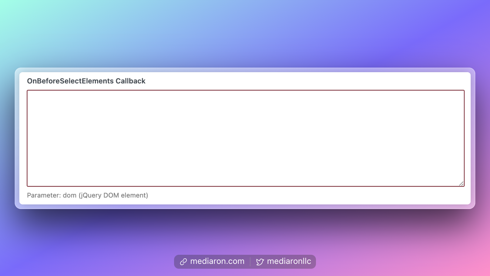
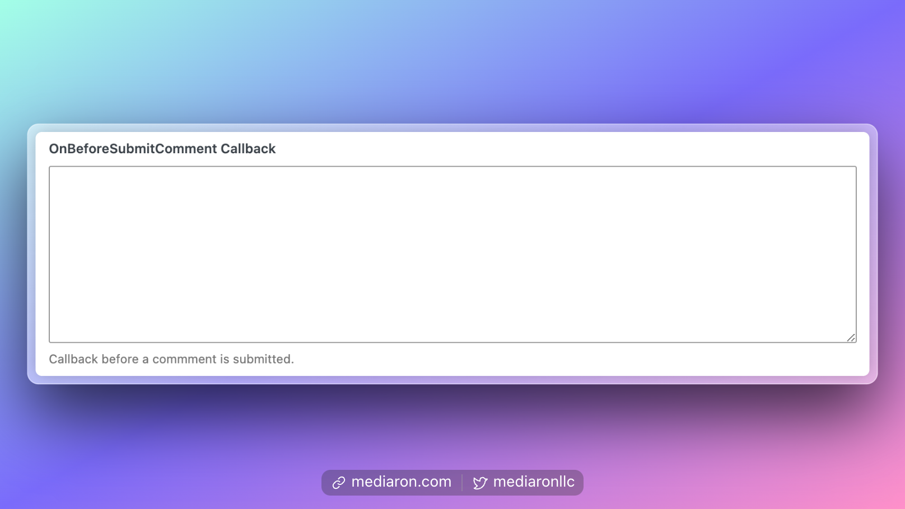
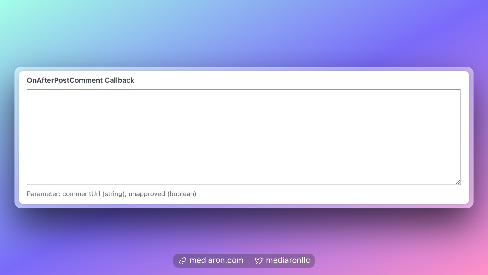
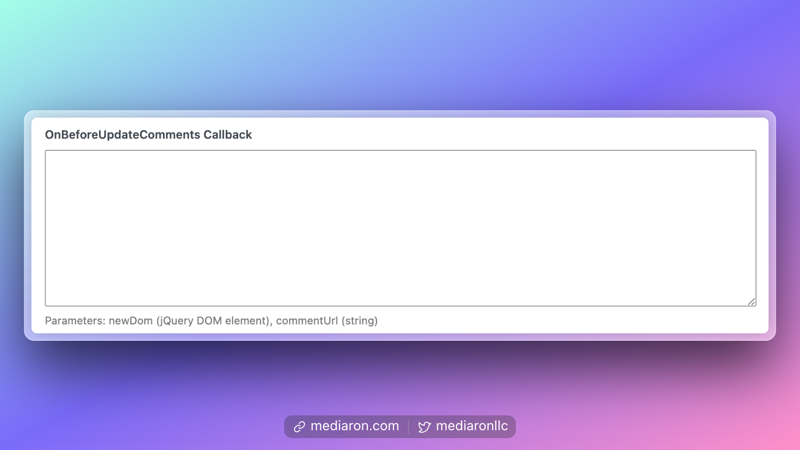
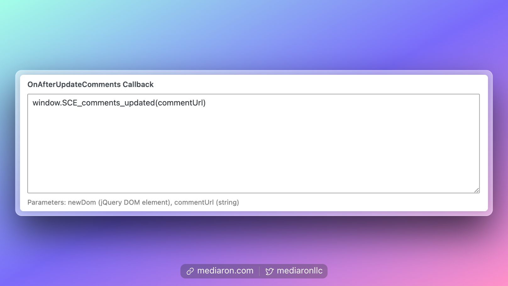

# Callbacks

Callbacks allow you to run custom JavaScript code in certain parts of execution. For example, if you have an Edit Comments plugin, you can run a custom function that initializes the plugin after a comment has been posted.

Each callback can pass arguments, which are documented below and will be in scope for any custom JS functionality that needs to run.

A common use-case of callbacks is another plugin that needs to run before, during, and after Ajaxify Comments loads.

### OnBeforeSelectElements Callback

This allows you to run JavaScript code before Ajaxify Comments has selected the DOM elements.

<figure><figcaption></figcaption></figure>

One argument is in scope, which is a jQuery representation of the DOM elements selected.

If you'd rather use a native JS event, you can use the event: **`wpacBeforeSelectElements`**

```javascript
document.addEventListener( 'wpacBeforeSelectElements', function( e ) {
	console.log( 'Custom event fired:', e );
	console.log( 'Extracted body:', e.detail.dom );
} );
```

### OnBeforeSubmitComment Callback

<figure><figcaption></figcaption></figure>

This callback provides no arguments.

If you'd rather use a native JS event, you can use the event: **`wpacBeforeSelectElements`**

<pre class="language-javascript"><code class="lang-javascript"><strong>document.addEventListener( 'wpacBeforeSelectElements', function( e ) {
</strong>	console.log( 'Custom event fired:', e );
} );
</code></pre>

### OnAfterPostComment Callback

<figure><figcaption></figcaption></figure>

#### Arguments:

1. commentUrl (string)
2. unapproved (boolean)

If you'd rather use a native JS event, you can use the event: **`wpacAfterPostComment`**

```javascript
document.addEventListener( 'wpacAfterPostComment', function( e ) {
	console.log( 'Custom event fired:', e );
	console.log( 'Extracted body:', e.detail.commentUrl, e.detail.unapproved );
} );
```

### OnBeforeUpdateComments Callback

<figure><figcaption></figcaption></figure>

#### Arguments

* newDom (jQuery DOM element)
* commentUrl (string)

If you'd rather use a native JS event, you can use the event: **`wpacBeforeUpdateComments`**

```javascript
document.addEventListener( 'wpacAfterPostComment', function( e ) {
	console.log( 'Custom event fired:', e );
	console.log( 'Extracted body:', e.detail.newDom, e.detail.commentUrl );
} );
```

### OnAfterUpdateComments Callback

<figure><figcaption></figcaption></figure>

#### Arguments

* newDom (jQuery DOM element)
* commentUrl (string)

```javascript
document.addEventListener( 'wpacAfterUpdateComments', function( e ) {
	console.log( 'Custom event fired:', e );
	console.log( 'Extracted body:', e.detail.newDom, e.detail.commentUrl );
} );
```
