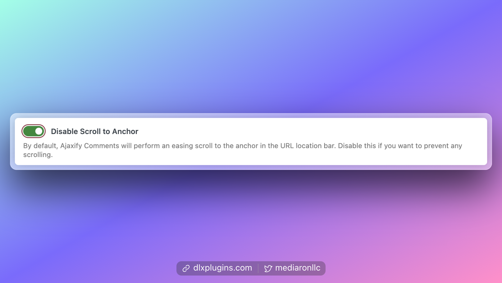

# Disable Scroll to Posted Comment (Anchor)

<figure><figcaption>
Advanced Tab Option for Disable Scroll to Anchor
</figcaption></figure>

When leaving comments, Ajaxify Comments will try to scroll to the comment so it is in view when posted.

Disabling the Scroll to Anchor feature prevents any such scrolling from occurring.

