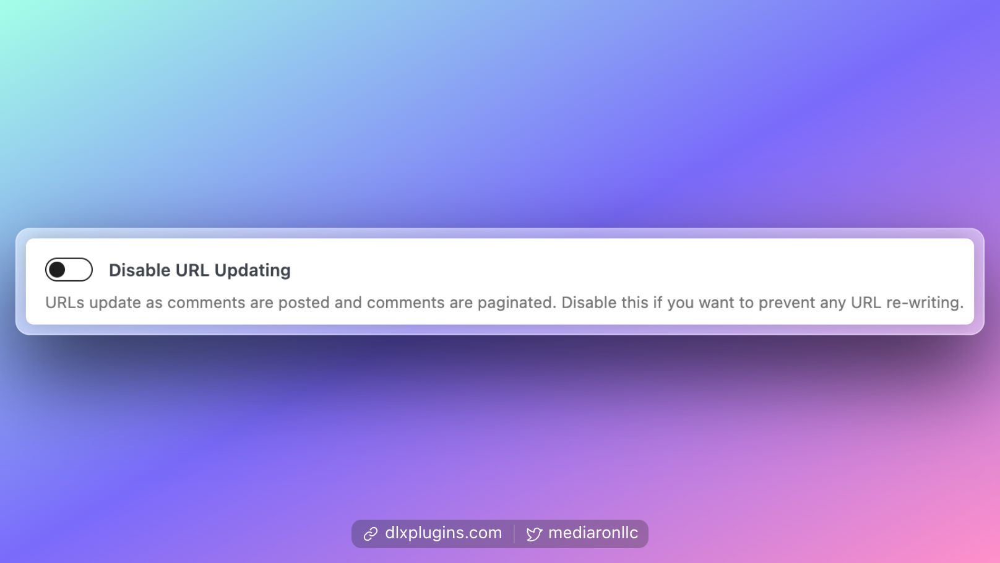
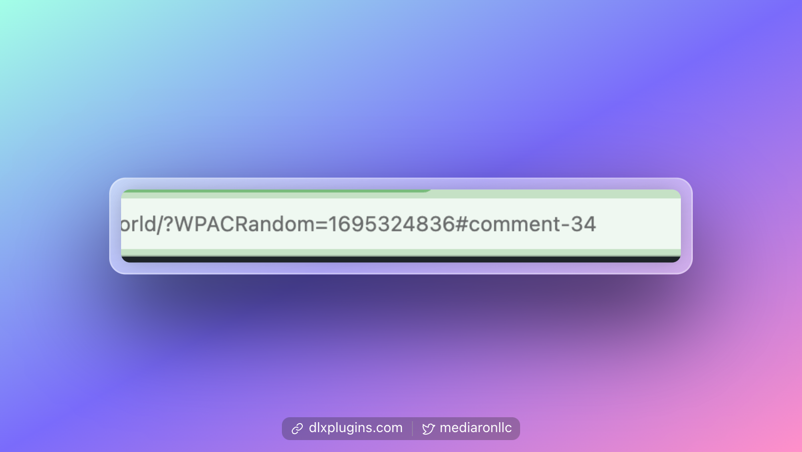

# Disable URL Updating

<figure><figcaption>
URL Updating is Enabled by Default
</figcaption></figure>

Ajaxify Comments will try to update the URL location bar to keep track of its state. You can disable this feature if you wish to prevent the URLs from being updated dynamically.

Here is an example of a dynamic URL created:

<figure><figcaption>
Example Dynamic URL
</figcaption></figure>
