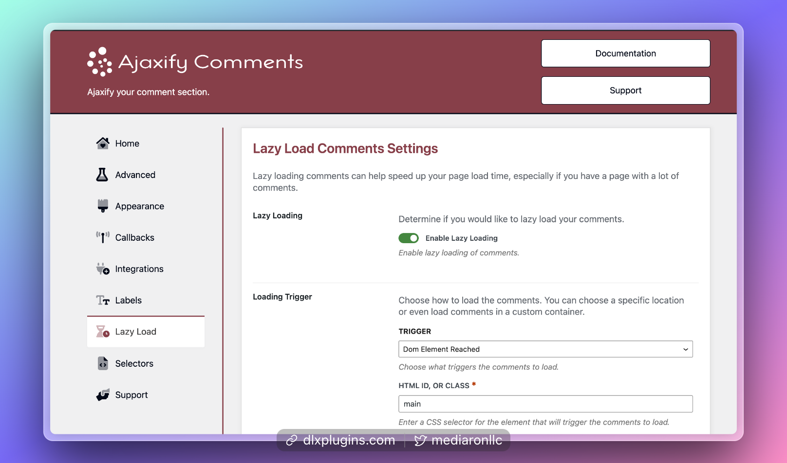
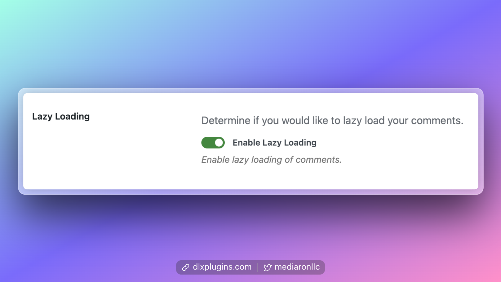
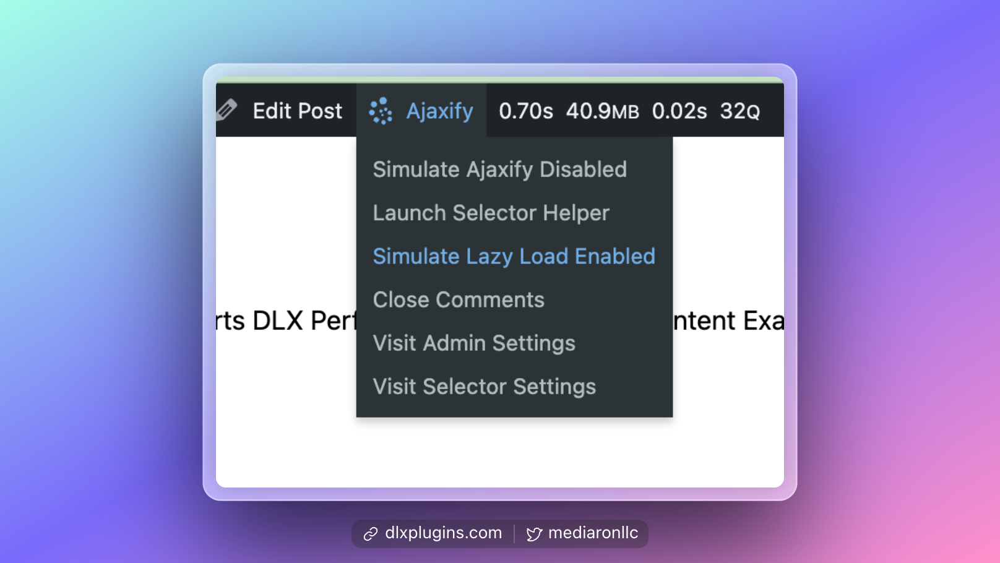
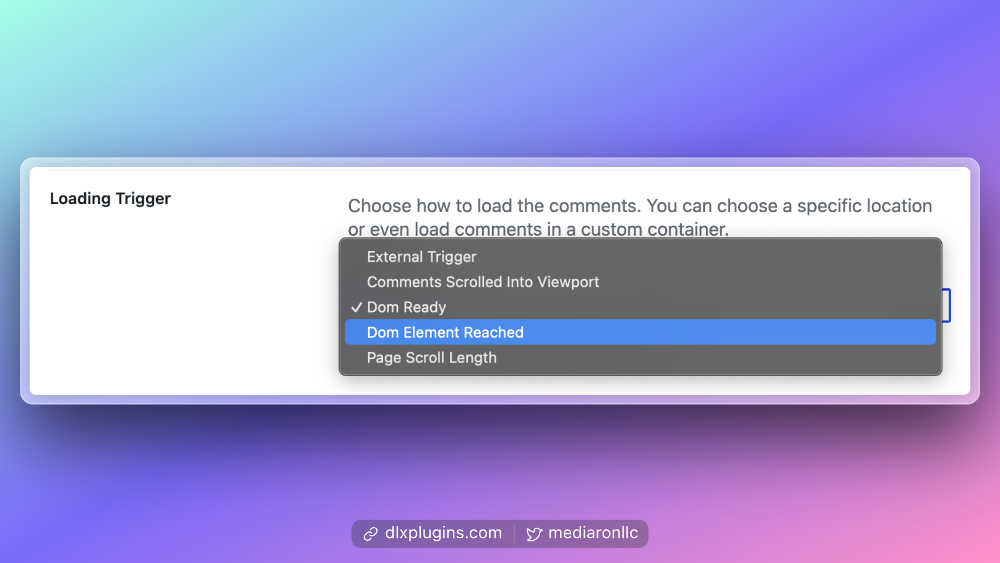
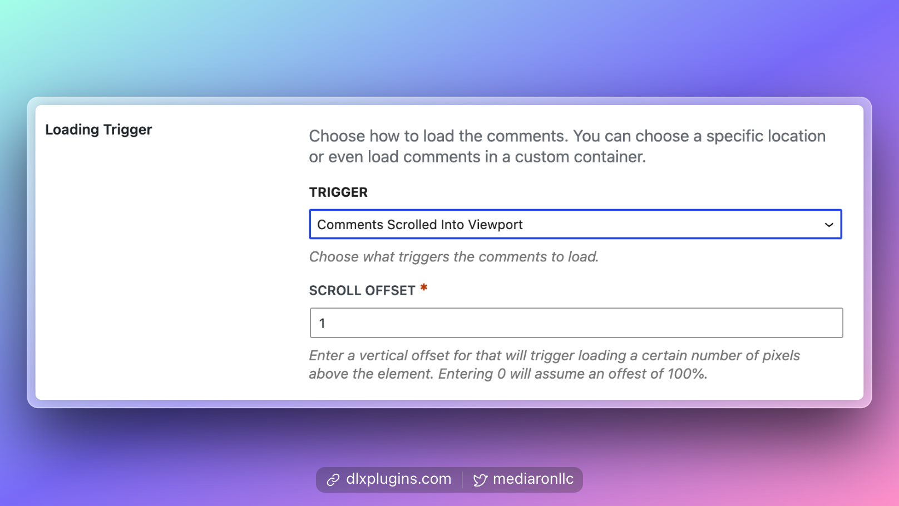
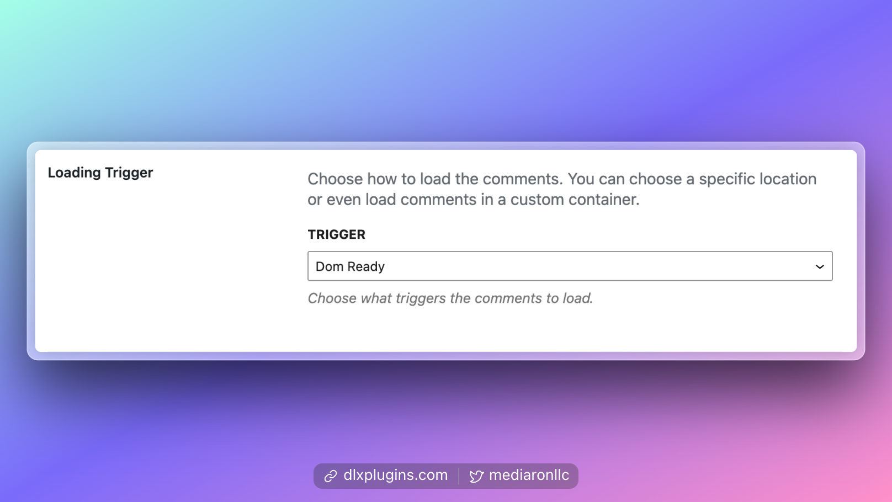
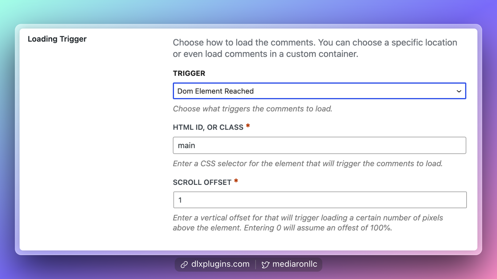
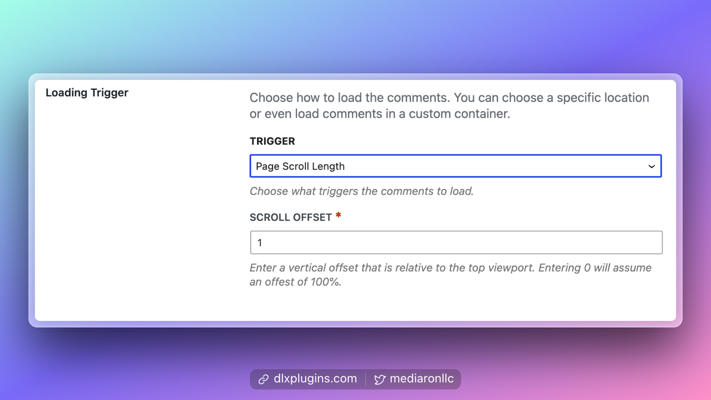
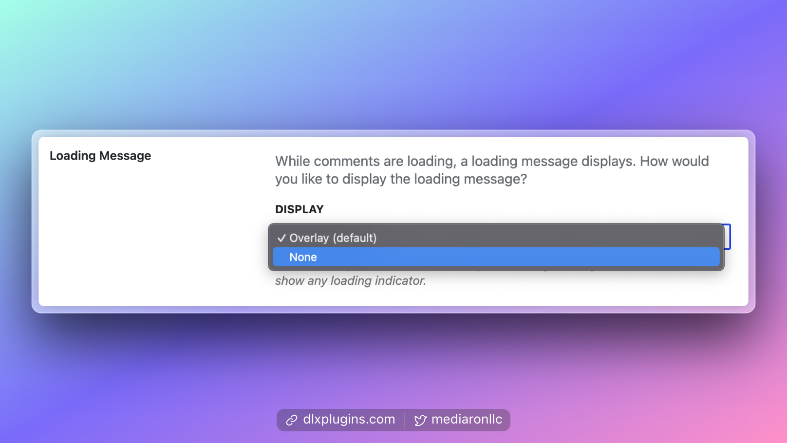
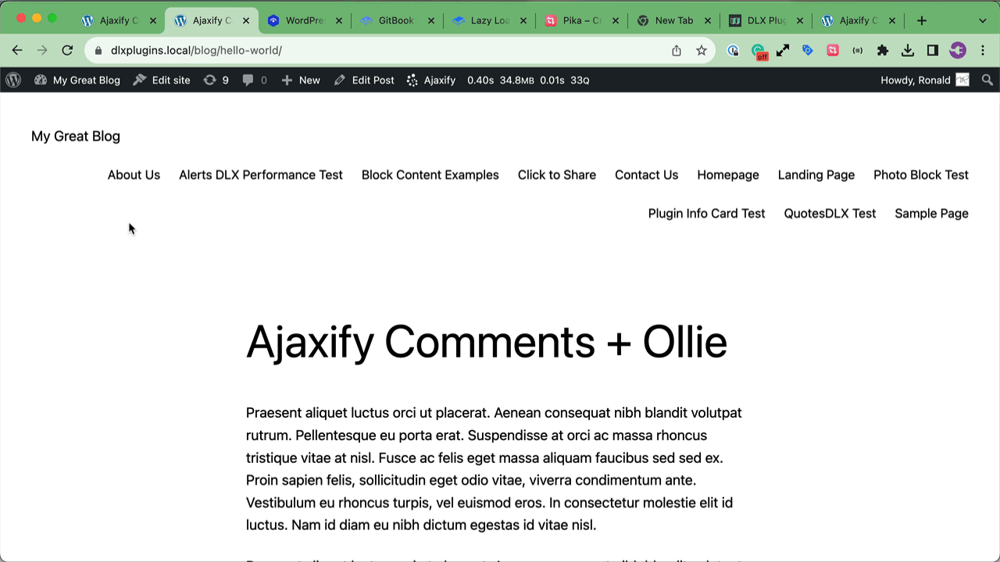

# Lazy Loading Comments

Lazy-loading comments can improve the page load of your blog posts and pages. If there are a lot of comments on a post, this can slow down the page's loading speed.

<figure><figcaption><p>Lazy Loading Admin Options</p></figcaption></figure>

### Prerequisite: Please set your selectors first


**Make sure you set your selectors first.** You can use Menu Helper to help set your selectors.



[selectors.md](selectors.md)



[menu-helper.md](../first-time-users/menu-helper.md)


### Enabling Lazy Loading

<figure><figcaption><p>Enable Lazy Loading Option</p></figcaption></figure>

Find the Lazy Load options in the admin settings. The first option on the page allows you to enable or disable lazy loading for comments.


[finding-the-settings.md](../first-time-users/finding-the-settings.md)


### Testing Lazy Loading

You can use Menu Helper to simulate lazy loading before it's activated.

<figure><figcaption><p>Simulate Lazy Loading Enabled or Disabled</p></figcaption></figure>


[menu-helper.md](../first-time-users/menu-helper.md)


### Setting the Triggers

<figure><figcaption><p>The Types of Lazy Load Triggers</p></figcaption></figure>

Here are the types of Triggers and what you can do for each one.

#### External Trigger

Comments do not load unless specifically invoked by an external source.

The external source will want to call this JavaScript function to load in the comments:

```javascript
WPAC.RefreshComments();
```

#### Comments Scrolled Into Viewport

<figure><figcaption><p>Comments Scrolled Into Viewport Option</p></figcaption></figure>

This option allows Ajaxify Comments to load when the comments section has been reached. This will be useful for never loading the comments for the user until that user reaches further down the page in the comments section.

You can adjust a vertical scroll offset (in pixels) to "trigger" loading a certain distance above the comments section.

#### Dom Ready (Default)

<figure><figcaption><p>Dom Ready Option</p></figcaption></figure>

This will load comments once the page has finished loading. This is the default behavior.

#### Dom Element Reached

<figure><figcaption><p>Dom Element Reached</p></figcaption></figure>

This option allows you to set which HTML element or CSS selector must be scrolled into view in order to load comments.


**Use a valid CSS selector using jQuery notation** (`.css-class,#css-id,form`)


For example, if you set a selector to some Related Posts at the bottom of your content, the comments will load in when the posts are scrolled into view.

You can set the scroll offset so that the loading occurs a certain number of pixels above the offset.


**Units are in pixels**: Scroll offset is in pixels.


#### Scroll Distance Trigger

<figure><figcaption><p>Load Comments a Number of Pixels from the Top</p></figcaption></figure>

You can set the loading trigger to be scroll distance. This will load the comments when a user reaches a certain number of pixels from the top of the screen.

### Setting the Loading Settings and Messages

<figure><figcaption><p>Overlay Options</p></figcaption></figure>

You can choose between an overlay or no overlay for lazy loading. An animation of the loading popover is below.

<figure><figcaption><p>Lazy Loading Overlay</p></figcaption></figure>

The Overlay can be configured in the Appearance settings.


[appearance-settings.md](../customization/appearance-settings.md)

