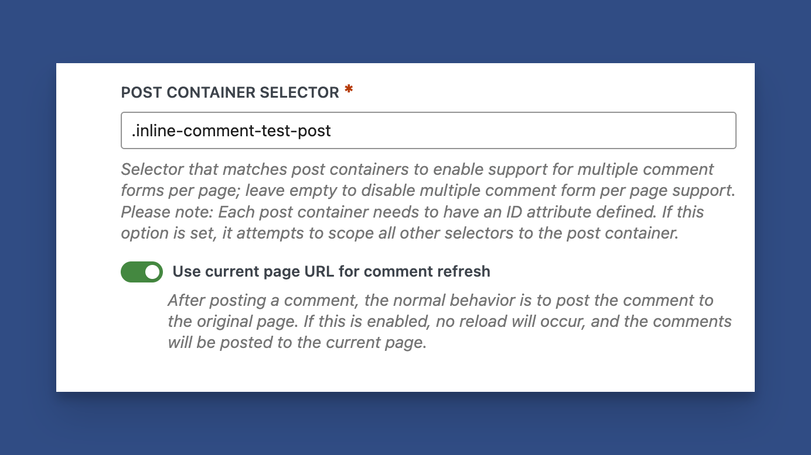

# Multiple Articles and Comment Sections Per Page

This guide is for sites that display more than one post's full content and comment form on a single WordPress screen (for example, a custom page that loops posts or a “reader” layout). Ajaxify Comments works best on a normal single post or page; multi-post layouts need some tweaking.

### Step 1: Add a Post Wrapper Selector for Each Article

<figure><figcaption><p>Post Container Selector Option</p></figcaption></figure>

In the admin settings, find **Selectors**.

Use **Selectors → Post Container Selector** so it matches every post wrapper (for example `article.multi-post-item`). The plugin registers handlers per wrapper and scopes **every** comma-separated selector segment under that id (so `article.multi-post-item #commentform, .comment-form` becomes `article.multi-post-item #commentform, article.multi-post-item .comment-form` internally).

Best when you control the loop markup and can add a class per post instance.

jQuery matches **each** wrapper’s subtree. One `AttachForm()` covers all posts.

**HTML note:** Duplicate `id` values are invalid HTML, but many themes do it inside a loop; this pattern is still the practical way to target those forms until markup is fixed to use classes.


Enable the **Use current page URL** option under **Selectors** to stay on the same page after a comment post.


### Step 2: Disable Comment Pagination in WordPress' Discussion Settings

<figure><figcaption><p>Disable Comment Pagination</p></figcaption></figure>

Single-page layouts do not work with comment pagination. Please turn it off under **Settings > Discussion**.&#x20;

### What you should know

* After someone submits a comment, WordPress redirects the browser to a “thank you” URL (usually the post permalink with `#comment-123`). The plugin intercepts that flow with AJAX and then **fetches HTML** from the redirect URL to refresh the comment area.
* If you want visitors to **stay on the same list page** instead of jumping to each post's permalink, you must ensure the redirect URL and selectors match the list page. The plugin can use the current page URL for comment refresh, so the address bar and scroll logic use the page you are on.
* Duplicate `#comments` / `#respond` IDs across posts are invalid HTML. The workarounds are not ideal.

### Technical steps

#### 1. Markup: one wrapper per post

**Path 1** example:

```html
<article class="multi-post-entry">
  <!-- title, content, comments template -->
</article>
```

#### 2. Selectors (Ajaxify Comments → Selectors)

* Inner selectors have CSS classes; every comma-separated part is prefixed with `.your-wrapper-class` for each matched post container.
* Follow the Post Container field help: avoid a single global ID as a selector.

#### 3. “Use current page URL for comment refresh” (setting)

When enabled (Selectors → Advanced Selectors), after a successful AJAX comment post the plugin uses **`window.location.href`** for URL updates, scroll target extraction, and safe fallbacks instead of only the `X-WPAC-URL` response header.

**When it helps**

* Custom list or archive-like pages that force a redirect back to the current page.

**When you might leave it off**

* Standard single post templates where the default redirect URL and header already match the page you are updating.

### Troubleshooting

| Symptom                                                  | Things to check                                                                                                                         |
| -------------------------------------------------------- | --------------------------------------------------------------------------------------------------------------------------------------- |
| Redirect goes to single post                             | Make sure the `Use Current Page for Comment Refresh` is enabled. You can also try disabling `URL Updating` under Advanced.              |
| Overlay stuck on “Reloading page” + URL error in console | Often, a relative or invalid URL in a fallback path. Turn on Debug mode and note any messages. You may need to leave a support request. |
| Wrong comment list updates                               | Selectors not scoped per post                                                                                                           |
