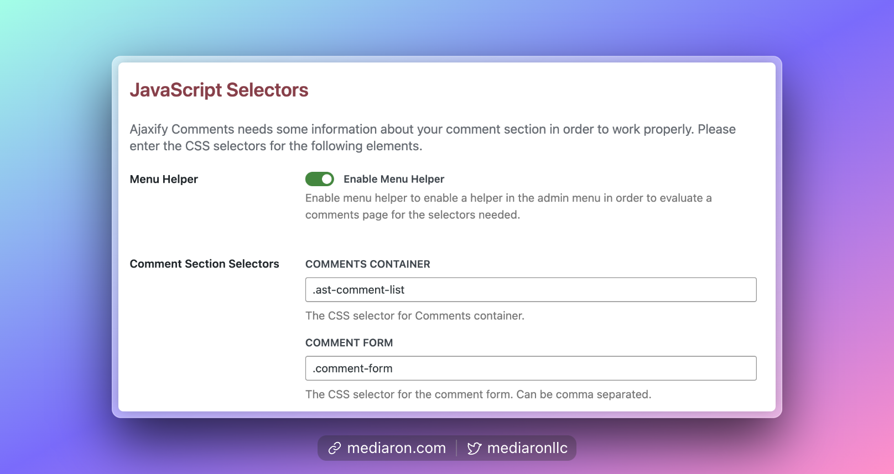
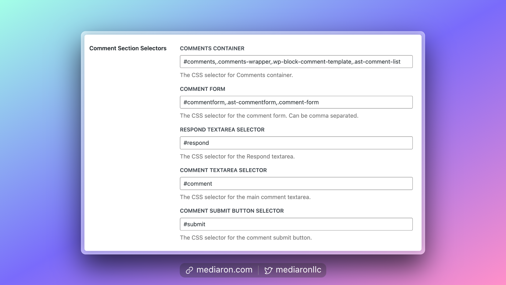
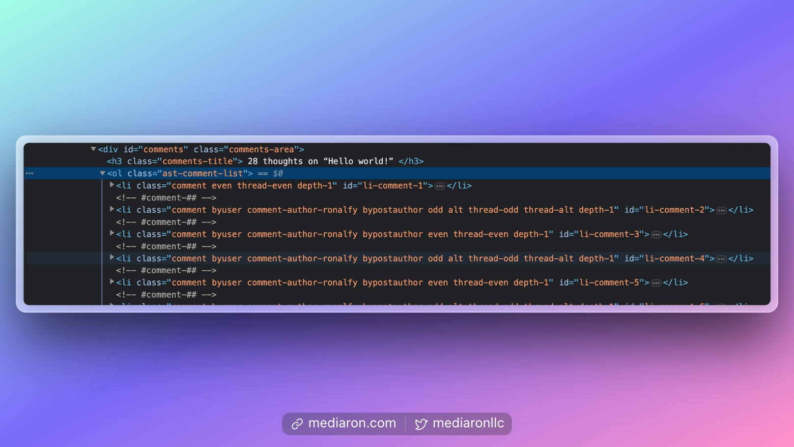
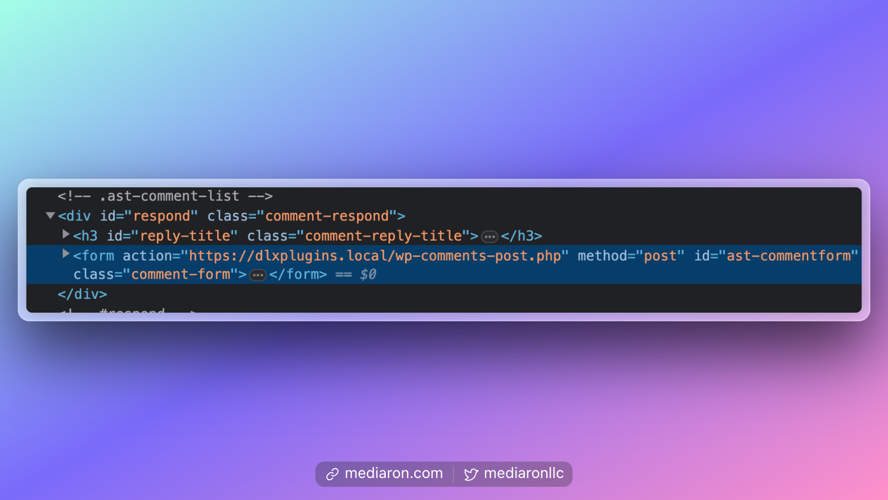
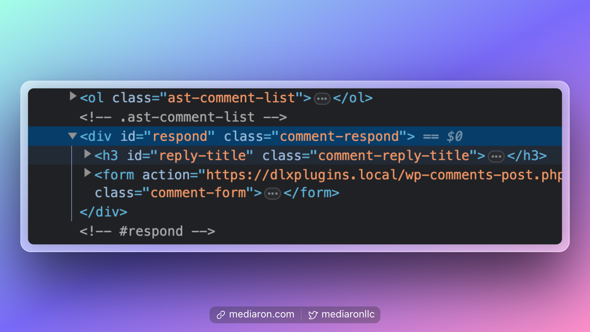
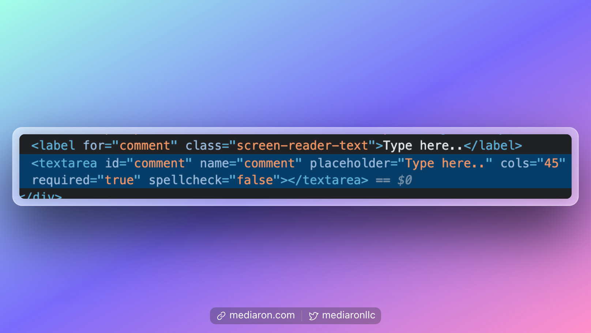
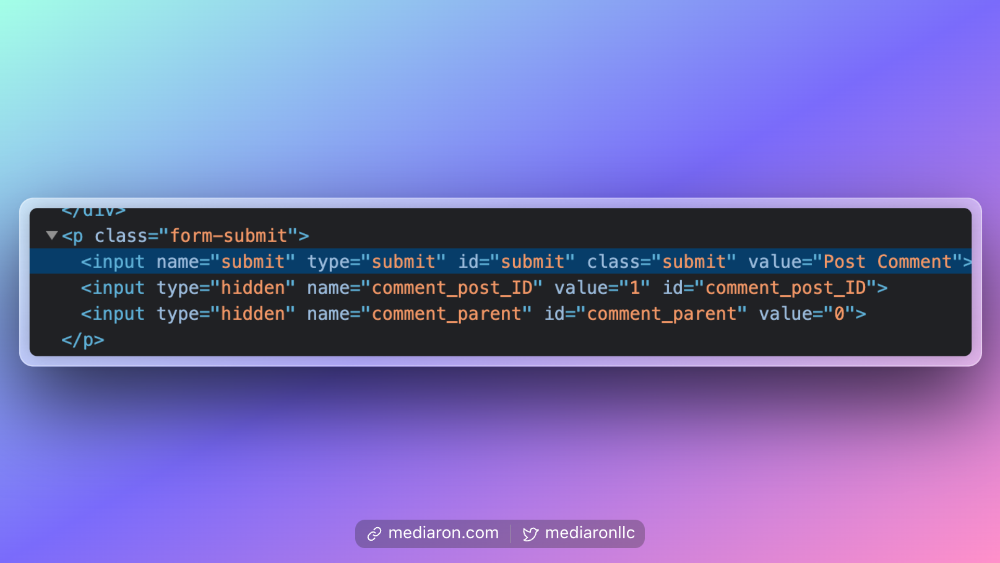

# Selectors

Selectors help tell Ajaxify Comments about your comment section.

<figure><figcaption>
Selectors in the Admin Settings
</figcaption></figure>

Selectors can be an advanced topic, so it's best to allow **Menu Helper** to help with finding the right selectors.


[menu-helper.md](../first-time-users/menu-helper.md)


To find the right selectors, it's recommended to open the developer tools in your browser and go to elements.

<figure><figcaption>
Default Selectors Shown
</figcaption></figure>


Selectors must be compatible with jQuery notation. IDs must have a `#` sign and classes must have a `.` in front of them.


### Comments Container Selector

This container wraps the comments list. You can usually find it by opening the dev tools and finding an individual comment.

Trace this comment back to its parent container, and you'll find the container ID or class.

<figure><figcaption>
Find the wrapper around the individual comments
</figcaption></figure>

### Comment Form Selector

This is the wrapper ID or class for the `form` element in the comments section.

<figure><figcaption>
Find the ID or Class of the comment form element
</figcaption></figure>

This can usually be found by inspecting the comment form's textarea element and tracing it back to the `form` parent element.

### Respond Selector

This wraps the respond area for the comment section.

You can usually find this by selecting the comment form's textarea and tracing it back to the form's parent container.

<figure><figcaption>
The Respond Selector wraps the comment form
</figcaption></figure>

### Comment Textarea Selector

This is the comment form's textarea field and can be found by selecting the comment's textarea.

<figure><figcaption>
Textarea field that shows the ID of the textarea
</figcaption></figure>

### Comment Submit Button Selector

This is the submit button for the comment section. It can be found by selecting the submit button and finding the ID or class of the button or input.

<figure><figcaption>
Submit Button Selector Example
</figcaption></figure>

### Advanced Selectors

Advanced Selectors must be in jQuery notation.
