# WPML and Translations

[WPML](https://wpml.org/) is a popular multi-language plugin that allows you to translate strings for multiple languages using WordPress.

[#translating-ajaxify-comments-labels](wpml-and-translations.md#translating-ajaxify-comments-labels "mention")

[#translating-the-remainder-of-ajaxify-comments-strings](wpml-and-translations.md#translating-the-remainder-of-ajaxify-comments-strings "mention")

This guide will walk you through how to translate Ajaxify Comments using WPML.


**You need the WPML Multilingual CMS plan**: The [Multilingual CMS plan](https://wpml.org/purchase/) comes with the [String Translator add-on](https://wpml.org/documentation/getting-started-guide/string-translation/), which you'll need to translate Ajaxify Comments.


## Translating Ajaxify Comments Labels

<figure>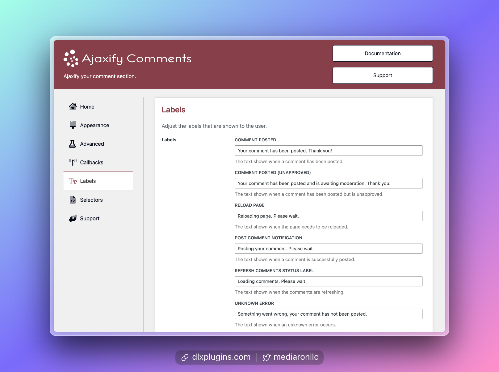<figcaption>
Labels Tab in Ajaxify Comments Settings
</figcaption></figure>

Ajaxify Comments has several labels available to translate. Here's how to translate them using WPML.

### Step 1: Discover which strings to translate

Ajaxify Comments has several labels that are displayed that can be translated. These can be found in the labels screen of Ajaxify Comments.


[labels-and-translations.md](../customization/labels-and-translations.md)


These labels are designed to be translated for one language, but you can use WPML and modify these labels per language.

### Step 2: Activate and Setup WPML and WPML String Translation

<figure>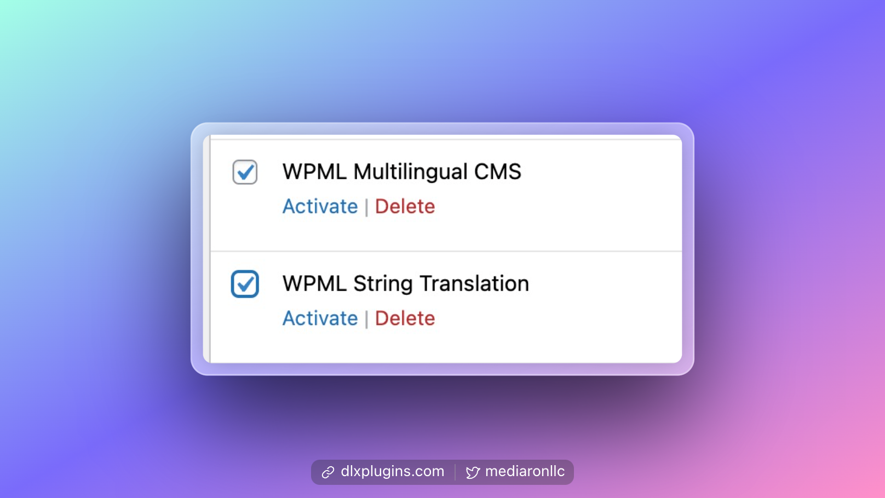<figcaption></figcaption></figure>

Install WPML and WPML String Translation and follow the setup process for the plugin.

### Step 3: Save any Ajaxify Options Screen

To register the strings for translation in WPML, we'll have to save the Ajaxify Comments settings.

Head to any of Ajaxify Comments admin screens and save the settings. This will register the strings.


[finding-the-settings.md](../first-time-users/finding-the-settings.md)


### Step 4: Head to WPML's Translation Management Screen

<figure>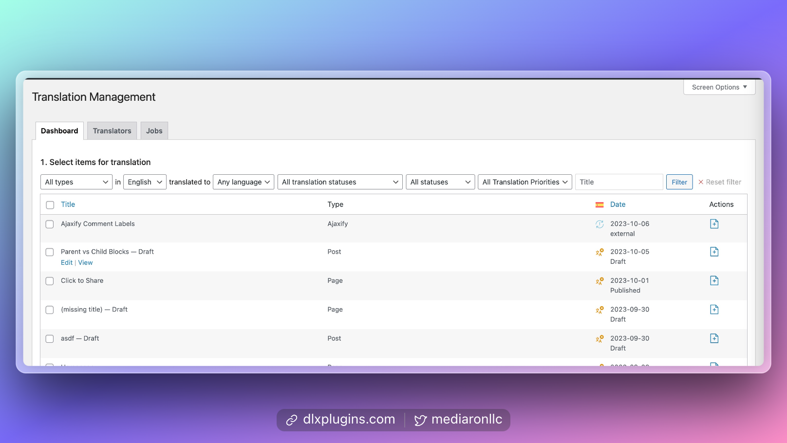<figcaption>
WPML's Translation Management Screen
</figcaption></figure>

Head to the Translation Management screen, which you can find in the WPML menu item.

### Step 5: Select the "Ajaxify" item from "All Types"

<figure>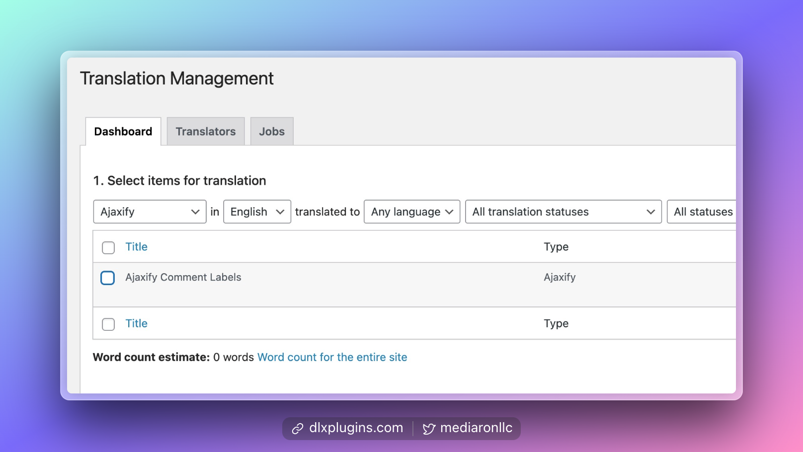<figcaption>
Ajaxify Comments on the Translation Management Screen
</figcaption></figure>

Select "Ajaxify" from the "Types" menu and filter. You can now select the "Ajaxify Comment Labels" item.

### Step 6: Select Ajaxify Comment Labels and Queue for Translation

<figure>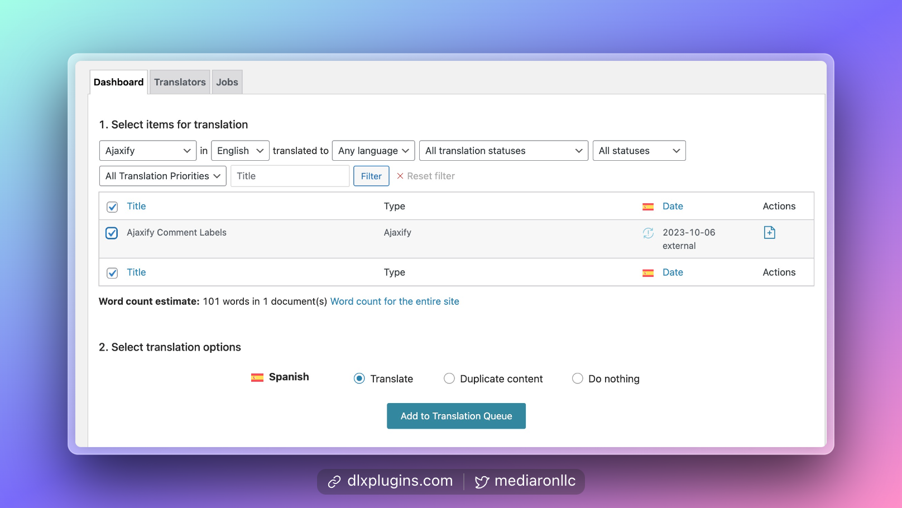<figcaption>
Queue Ajaxify Comments for Translation
</figcaption></figure>

Select "Ajaxify Comment Labels" and click the "Add to Translation Queue" button.

### Step 7: Head to the Translations screen to translate the options

Head to the "Translations" item under the WPML menu item.

<figure>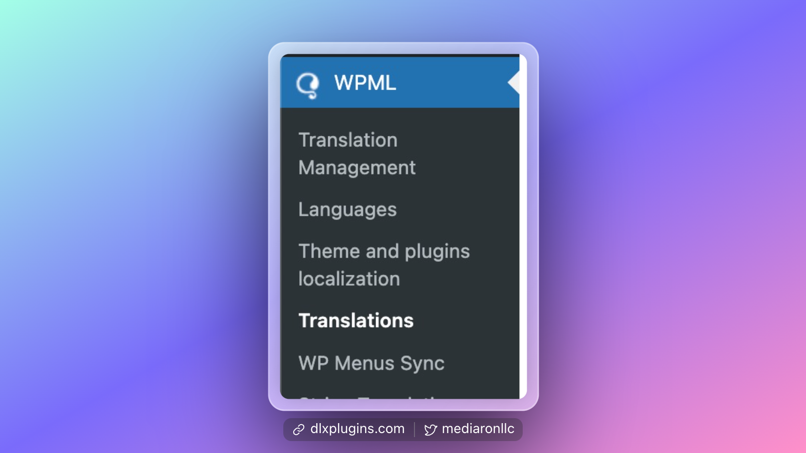<figcaption>
Translations Menu Item Under WPML
</figcaption></figure>

Once on the "Translations" screen, you'll be able to select "Ajaxify Comment Labels" and translate those.

<figure>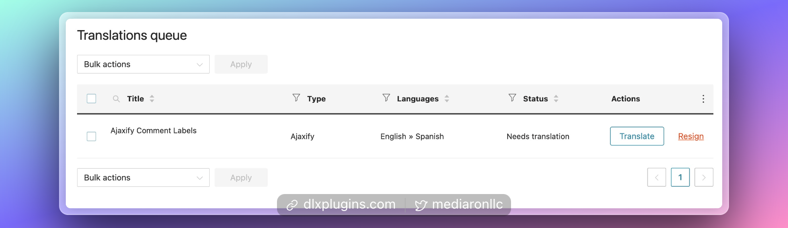<figcaption>
Ajaxify Comment Labels
</figcaption></figure>

While on the translate screen, you'll see the old labels that you can translate into your new language.

<figure>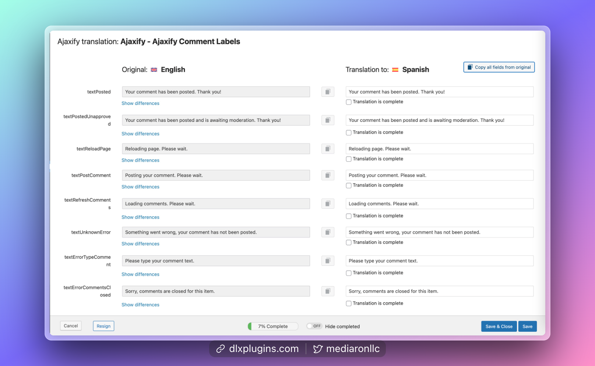<figcaption>
Ajaxify Comment Labels Translations Screen
</figcaption></figure>

Complete all of the translations, mark them as complete, and save.

<figure>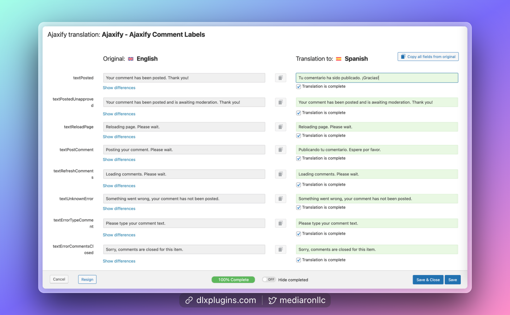<figcaption>
Translating Ajaxify Labels
</figcaption></figure>

### Step 8: Preview on the Frontend

Head to the frontend, and try to post a few test comments while in the alternate language.

<figure>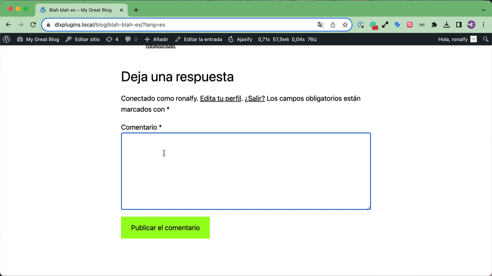<figcaption>
Translations on the Frontend
</figcaption></figure>

## Translating the Remainder of Ajaxify Comments Strings

The labels are one small part of Ajaxify Comments. In order to translate Ajaxify Comments wholistically, you need to head to the **Themes and Plugin Localization** menu item under WPML.

<figure>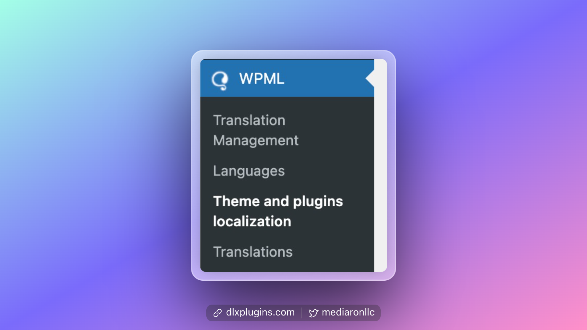<figcaption>
Themes and Plugins Localization Screen
</figcaption></figure>

Find the plugin `Ajaxify Comments` and scan for the strings.

<figure>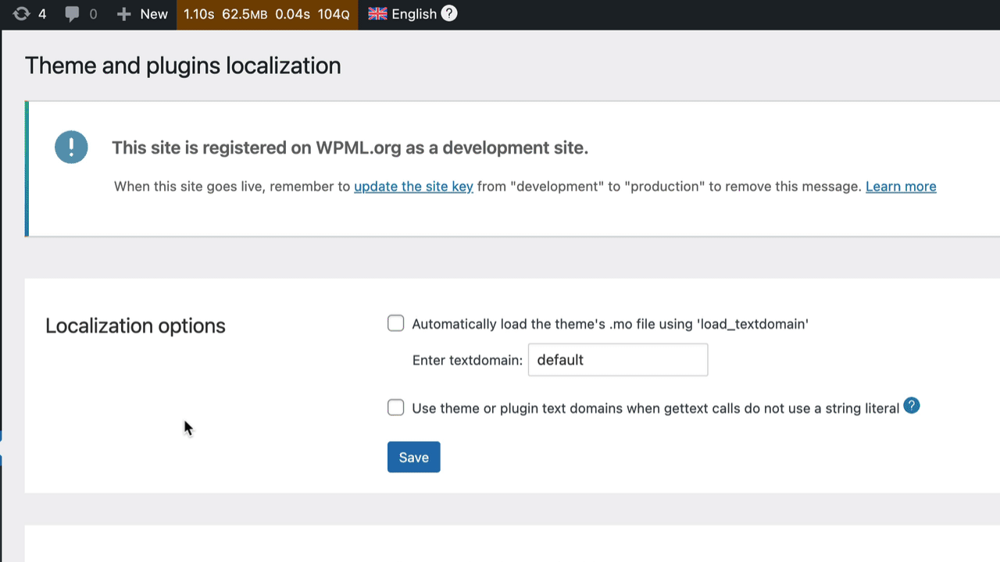<figcaption>
Select Ajaxify Comments and Scan Plugin Strings
</figcaption></figure>

While on the same screen, after scanning, select the "Ajaxify Comments" translation to edit it.

<figure>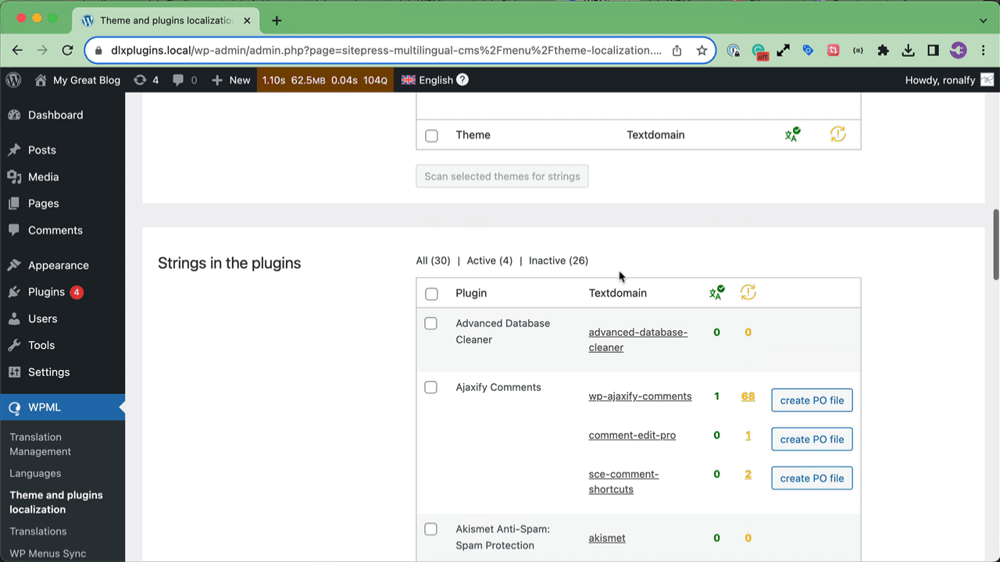<figcaption>
Translate Ajaxify Comment Strings
</figcaption></figure>

Alternatively, you can head to the **Strings Translation** under WPML and select the `wp-ajaxify-comments` domain.

<figure>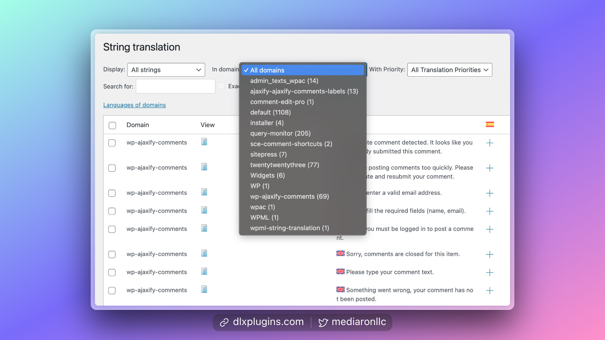<figcaption>
Look for 'wp-ajaxify-comments' on the Strings Translation Page
</figcaption></figure>

**Need more help?**

Please reach out to support.
