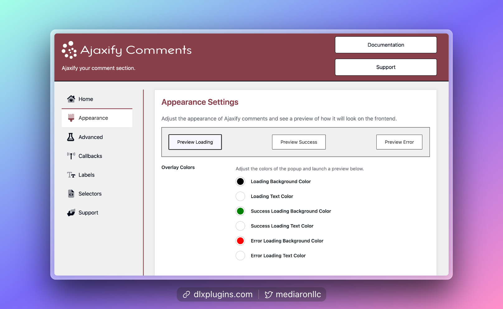

# Appearance Settings

<figure><figcaption>
Appearance Settings for the Comment Overlay
</figcaption></figure>

You can adjust the appearance of the comment overlay in the Appearance settings.

A sticky preview bar shows so you can launch a preview after adjusting settings.

You can adjust the following:

* Colors of the text and overlay
* The opacity of the overlay
* Padding and border-radius
* Font size and alignment
* Fade-in and fade-out speeds

Here's a GIF of how you can adjust the settings.

<figure><figcaption>
Adjusting the Appearance With Preview Bar
</figcaption></figure>
