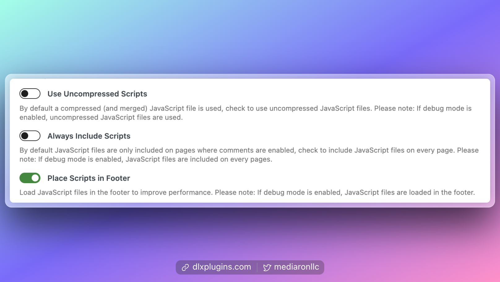

# Script Debugging

<figure><figcaption>
Script Debugging Options in the Advanced Section
</figcaption></figure>

The source files for the scripts are in [`/src/js/frontend`](https://github.com/DLXPlugins/wp-ajaxify-comments/tree/main/src/js/frontend) [in the GitHub repo](https://github.com/DLXPlugins/wp-ajaxify-comments).

### Uncompressed Scripts

All five Ajaxify Comments scripts will load separately if:

* Uncompressed scripts are enabled
* Debug mode is enabled for the plugin

### Always Include Scripts

This will load Ajaxify Comments everywhere. Please note that if `debug` mode is enabled, Ajaxify scripts will load everywhere in that case as well.

### Loading scripts in the footer

It is always advisable to load scripts in the footer for performance reasons.&#x20;

Scripts will load in the footer if:

* Place scripts in the footer is enabled
* Debug mode is enabled
* SCRIPT\_DEBUG is enabled
