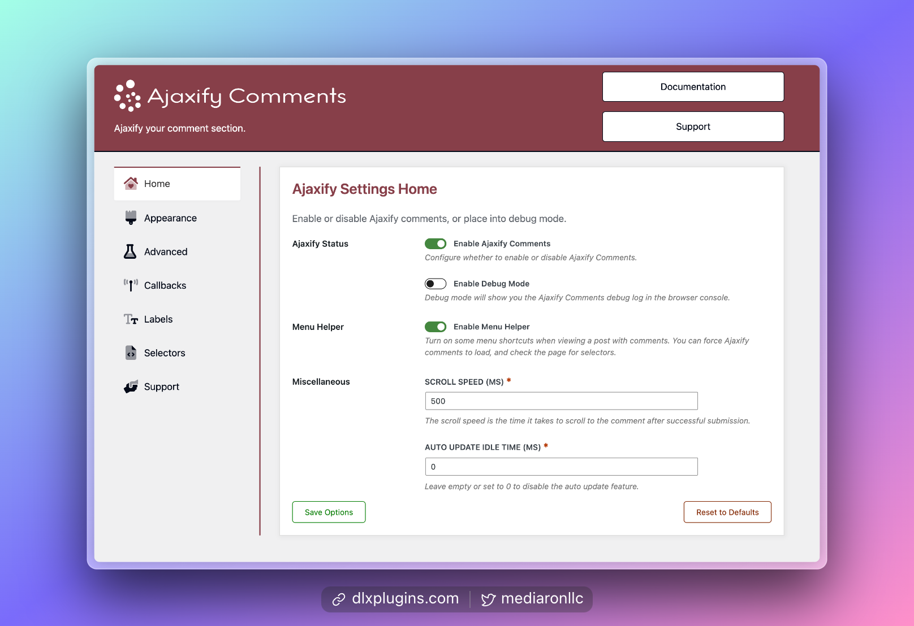
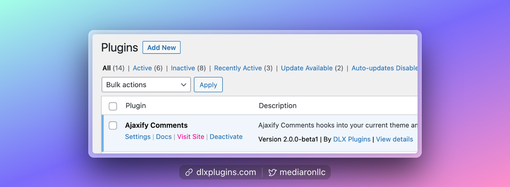
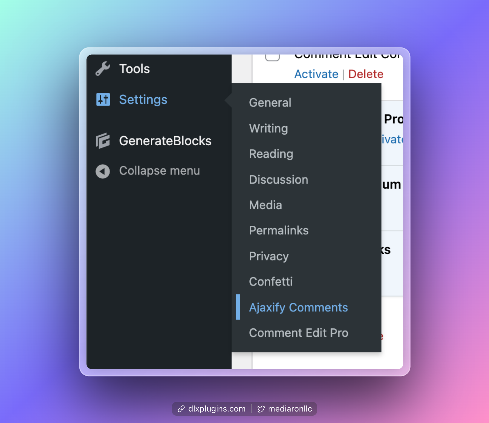

# Finding the Settings

<figure><figcaption>
Ajaxify Comments Admin Setting
</figcaption></figure>

## Finding the Admin Settings From the Plugins Screen 

<figure><figcaption>
Ajaxify Comments Plugin Row
</figcaption></figure>

If you are on the plugin's screen, search for **Ajaxify Comments** and click on the `Settings` link.

### Finding the Admin Settings from the Menu

Alternatively, in the admin menu, head to `Settings->Ajaxify Comments`.

<figure><figcaption>
Settings Menu in WordPress
</figcaption></figure>
