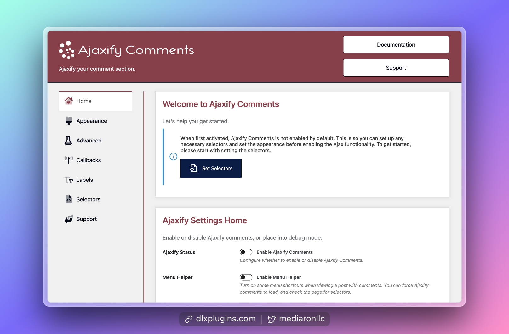
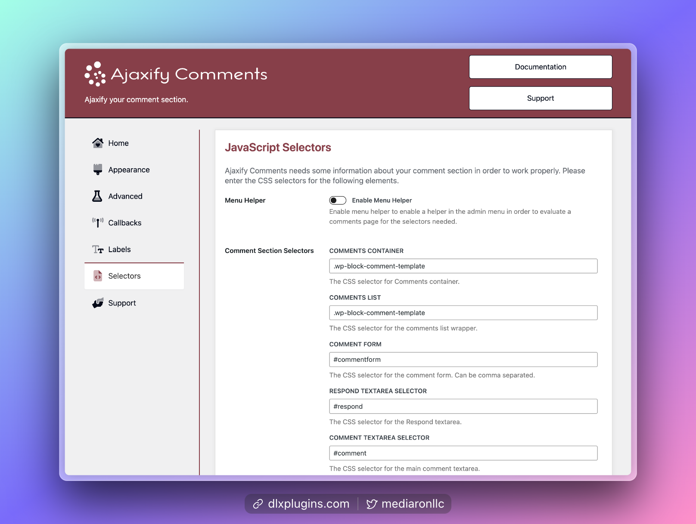
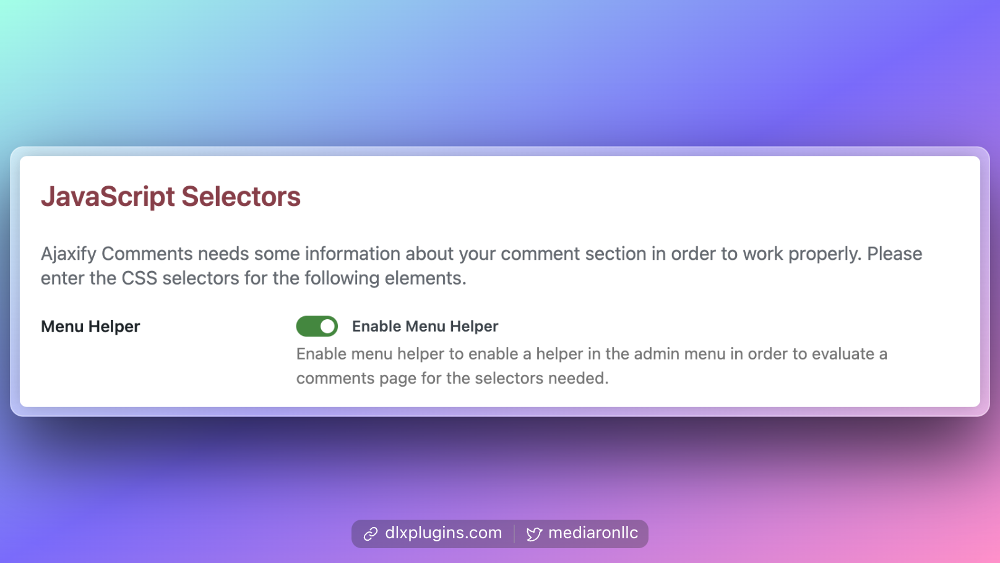
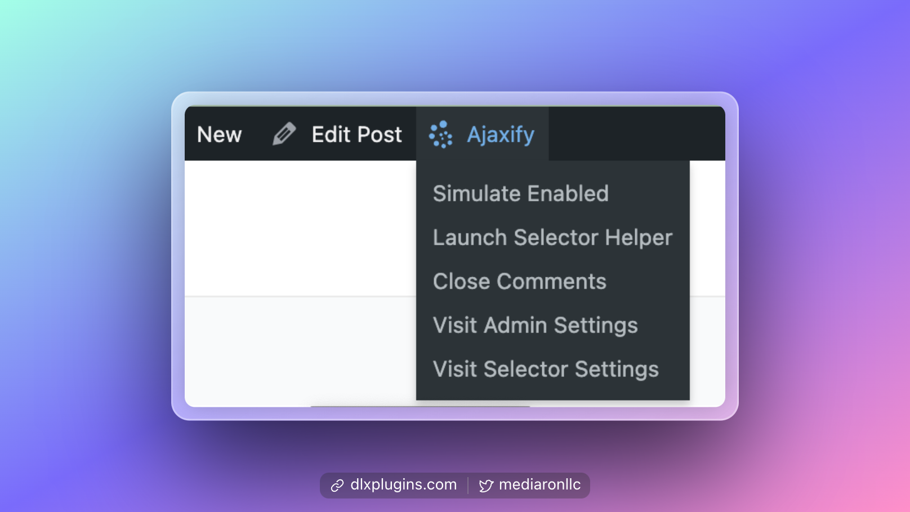
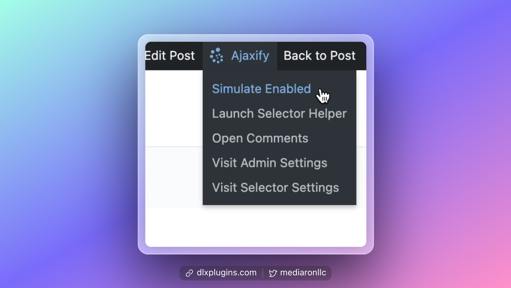
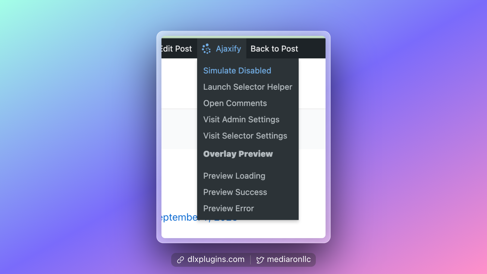
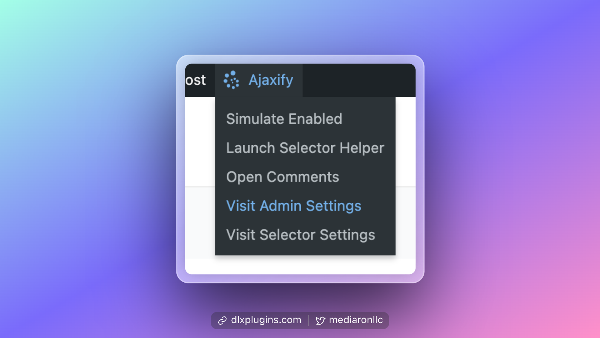
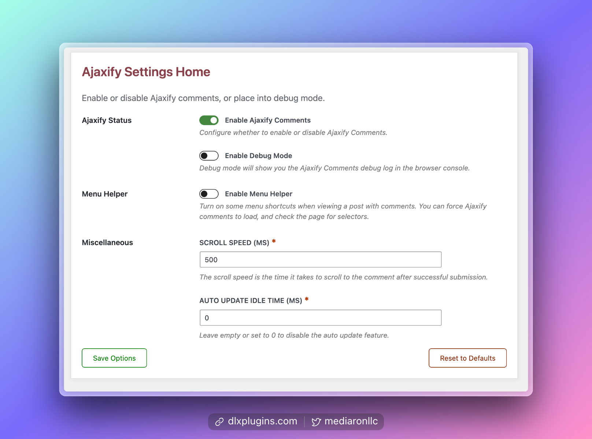

# Getting Started

<figure><figcaption>
Ajaxify Comments Admin Screen
</figcaption></figure>

When first installed, [Ajaxify Comments](https://dlxplugins.com/plugins/ajaxify-comments/) is disabled by default. This is so you can set up the selectors and appearance of Ajaxify Comments before enabling the plugin.

### Set up the Selectors

Head to the admin settings and view the Selectors tab. Selectors tell Ajaxify Comments about your comment section.

<figure><figcaption>
Selectors Admin Screen
</figcaption></figure>

If you are an advanced user, please enter the selectors that make up your comment section.

### Use Menu Helper to Find the Selectors


**Use Menu Helper**: Find a post or page with comments and use **Menu Helper** to assist in finding your selectors.


Selectors are an advanced topic requiring you to inspect your comment section's HTML source. This is why **Menu Helper** was created. For first-time setup, **Menu Helper** is available to help you along.

Go ahead and enable **Menu Helper.**

<figure><figcaption>
Menu Helper in the Enabled State
</figcaption></figure>

#### Navigate to a Post or Page With Comments Enabled

Find a post with comments enabled and navigate to the front end of that post (i.e., view it on the site).

With the admin bar enabled, you'll see **Ajaxify** in the top admin bar.

<figure><figcaption>
View "Ajaxify" in the Top Admin Bar
</figcaption></figure>

#### Launch Selector Helper

Selector Helper is a wizard that tries to scan your site's source code for the right comment selectors.


**Comments must be enabled, and at least one comment should be posted.**


The wizard will check if comments are enabled and at least one comment has been left on the post.

<figure><figcaption>
Error When Comments Are Disabled
</figcaption></figure>

If you need to enable comments, there is a shortcut in **Menu Helper.**

<figure><figcaption>
Open Comments Option in Menu Helper
</figcaption></figure>

If all checks pass, you'll see a success confirmation allowing the Selector Helper to run.

<figure><figcaption>
Initial Step of Selector Helper
</figcaption></figure>

Selector Helper first checks that there is at least one comment and that comments are open. If the tests pass, it will scan the source for the comment selectors.

<figure><figcaption>
Selectors Found with Selector Helper
</figcaption></figure>

If all of the selectors have been found, you'll see a table of the found selectors, which you can then save.

### Use Menu Helper to Simulate Ajaxify Comments Enabled

<figure><figcaption>
Simulate Ajaxify Comments Enabled
</figcaption></figure>

You can simulate what Ajaxify Comments will look like when enabled. Using **Menu Helper**, select "Simulate Enabled."

This will refresh the page, and you can post comments as if Ajaxify Comments is enabled. A "Back to Post" button will allow you to return to the page without Ajaxify Comments enabled.

<figure><figcaption>
Extra Options When Enabled
</figcaption></figure>

With Ajaxify Comments enabled, you can use **Menu Helper** to simulate the loading, error, and success messages that Ajaxify Comments uses. This is useful for adjusting the appearance and previewing the changes on the front end.

### Leave a Few Test Comments

Leave a few test comments and ensure all error messages work (posting duplicate comments, empty comments).

<figure><figcaption>
An Example of Posting a Comment With Errors
</figcaption></figure>

### Enable Ajaxify Comments

If comments are working as expected, it's time to enable Ajaxify Comments.

Using **Menu Helper**, visit the admin settings to enable Ajaxify Comments.

<figure><figcaption>
Use Menu Helper to Visit the Admin Settings
</figcaption></figure>

You can now enable Ajaxify Comments, and you can disable **Menu Helper**.

<figure><figcaption>
Admin Options Showing Ajaxify Comments Enabled
</figcaption></figure>

### Success!

<figure><figcaption>
Successful Comment Submission
</figcaption></figure>

### Help and Support

Please [leave a star rating](https://wordpress.org/support/plugin/wp-ajaxify-comments/reviews/). A lot of work has gone into making this plugin, and star ratings help spread awareness of the plugin and help improve the plugin's reputation.

If you need help or support, please use the [.org forums](https://wordpress.org/support/plugin/wp-ajaxify-comments/) or the [support form on DLX Plugins](https://dlxplugins.com/support/).
