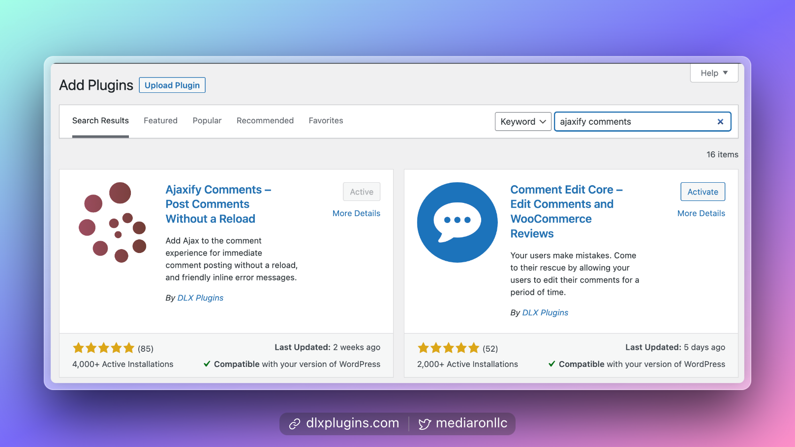

# Installing the Plugin

<figure><figcaption>
Install Ajaxify Comments via the Admin
</figcaption></figure>


**Ajaxify Comments is a free plugin**: Please [visit the plugin](https://wordpress.org/plugins/wp-ajaxify-comments/) on the WordPress Plugin Directory


## Install from the WordPress Admin

1. Log into your WordPress admin (i.e., your dashboard)
2. Go to Plugins->Add New
3. Type in "Ajaxify Comments"
4. Install and Activate the plugin

After activation, you can find the plugin's settings in the Dashboard under Settings->Ajaxify Comments.

## Install via FTP

1. Download the plugin zip file [from the WordPress Plugin Directory](https://wordpress.org/plugins/wp-ajaxify-comments/)
2. Unzip the plugin zip in a place you can remember for the next steps
3. Log into your FTP program of choice for your website
4. Upload the unzipped folder into `wp-content/plugins`
5. Log into your admin dashboard
6. Head to the plugins screen
7. Search for Ajaxify Comments.
8. Activate the plugin

After activation, you will be taken to the plugin's settings screen.
