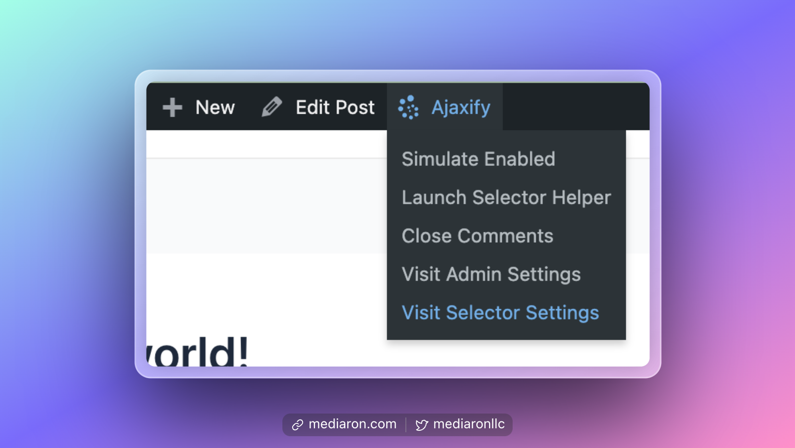
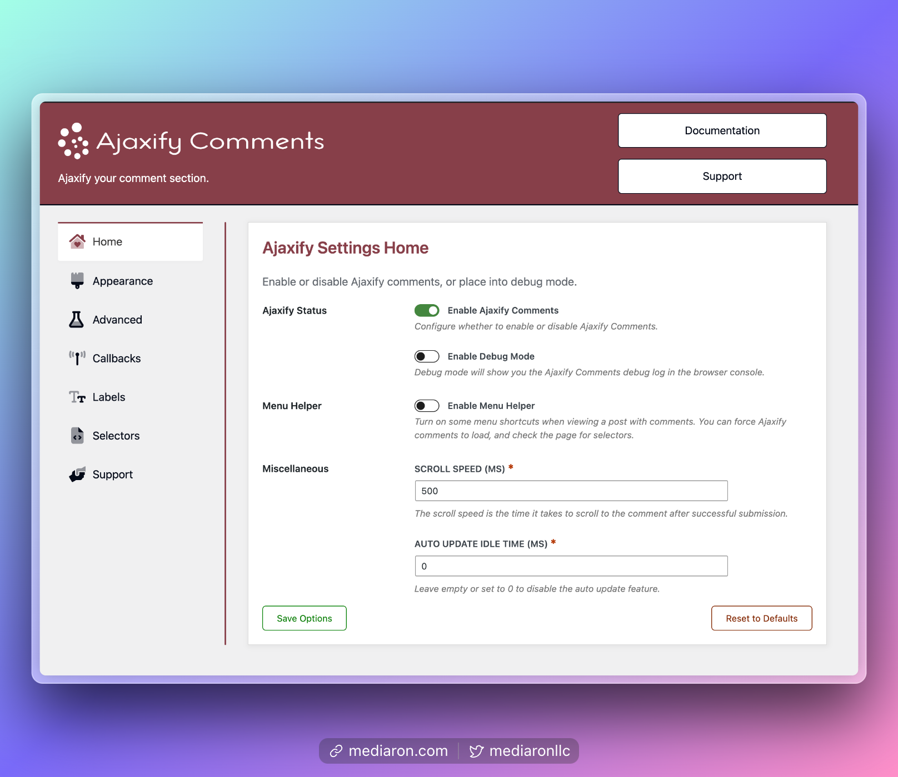
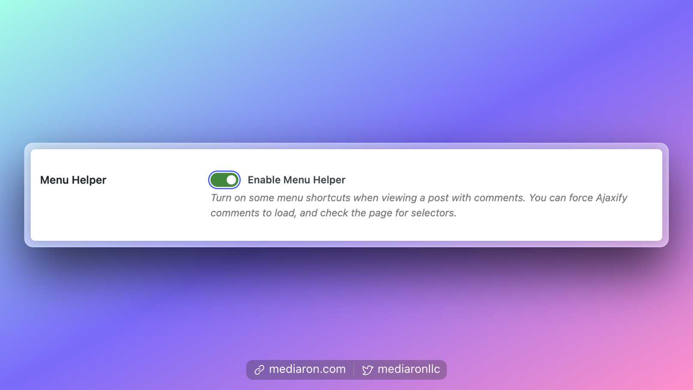
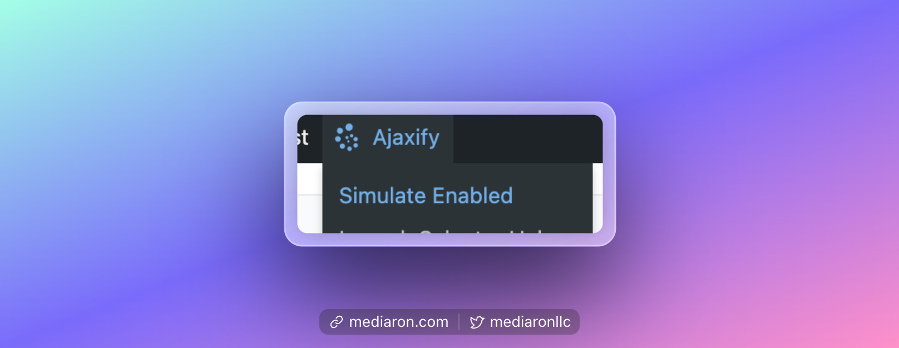
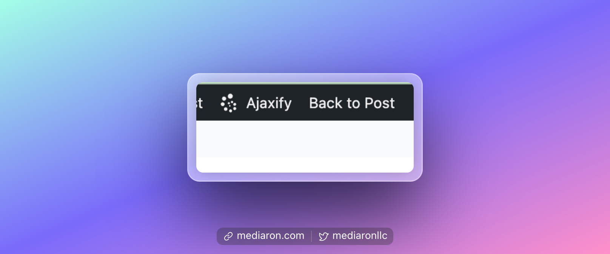
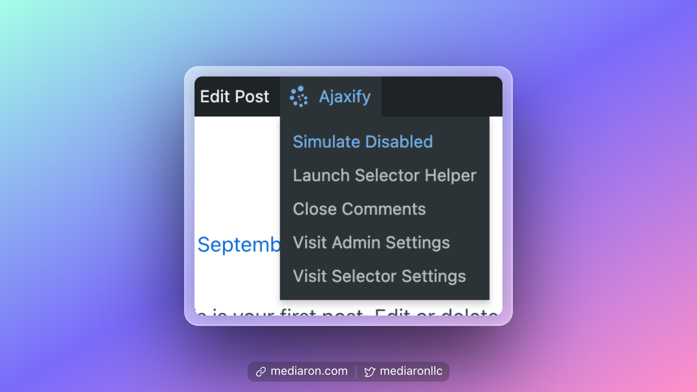
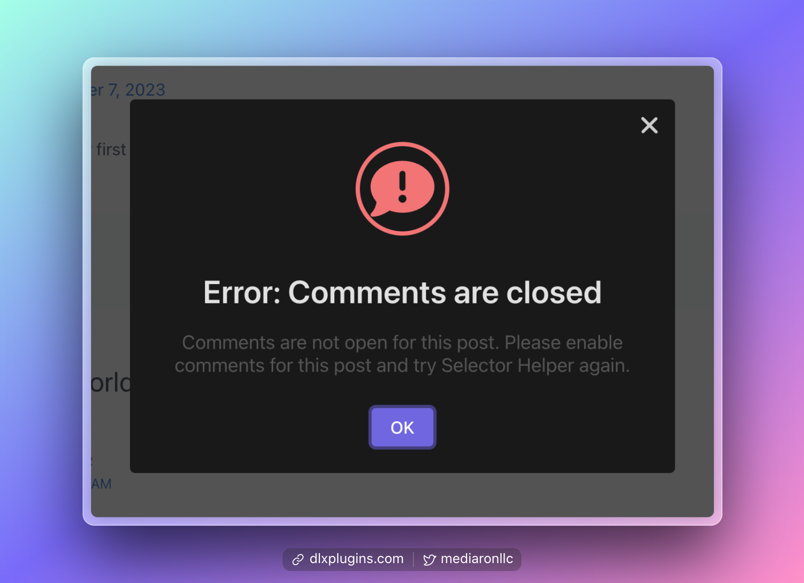
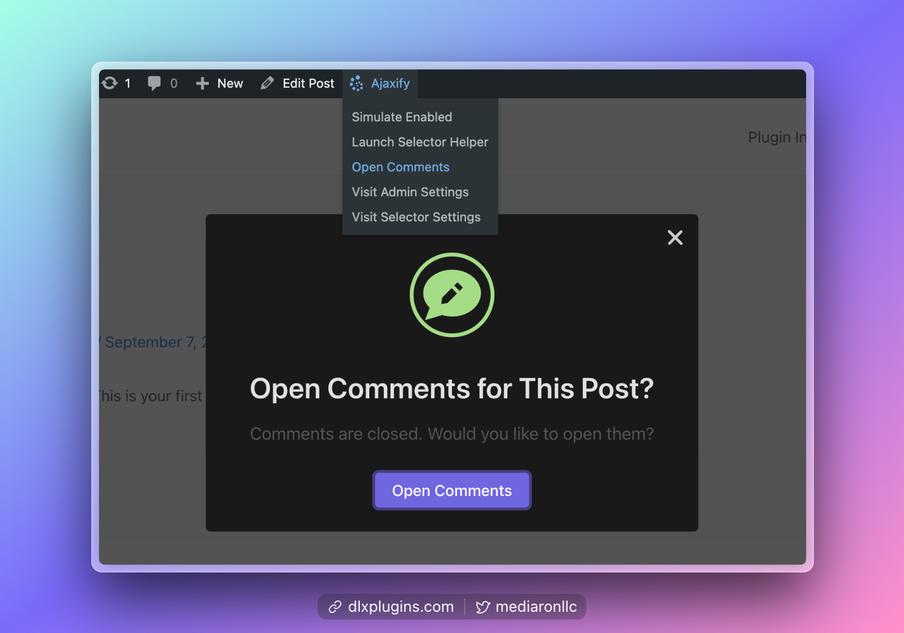
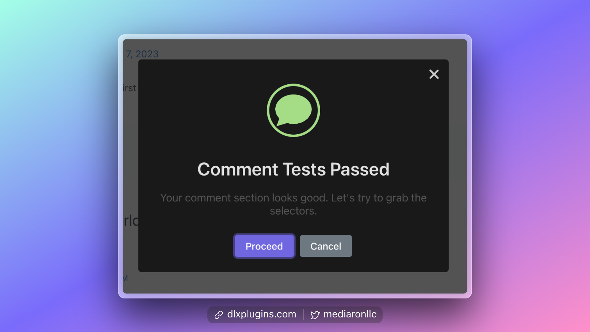
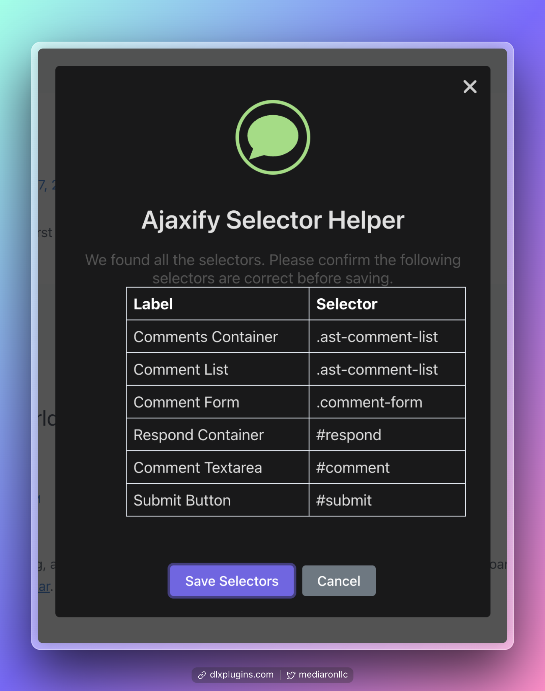

# Menu Helper

Menu Helper provides shortcuts in the admin bar and is helpful when you are first setting up the plugin. It is disabled by default but is easily enabled in the admin settings.

<figure><figcaption>
Menu Helper is a menu in the admin bar
</figcaption></figure>


**The Admin Bar Must Be Enabled**: Menu Helper lives in the admin bar, so if you don't see Menu Helper, go to your user profile and enable the admin bar on the front end.


Menu Helper has the following tools and shortcuts:

* **Simulate Enabled/Disabled** - Simulate the page with Ajaxify Comments enabled or disabled. This is useful for debugging and also testing out the plugin before enabling it on the site.
* **Launch Selector Helper** - This tool scans your page and tries to find the comment selectors for you.
* **Close/Open Comments** - Quickly open and close comments. Please note that for Selector Helper to work, comments must be open.
* **Preview Error Messages** - Launch the preview notifications that come with Ajaxify Comments. This is useful for previewing the notifications on the front end.
* **Admin Shortcuts** - Shortcuts to the admin settings and the selectors allow for quick navigation between the front and admin sections.

Here is how to enable Menu Helper and how to use some of the various shortcuts and tools included.

### Enabling Menu Helper

<figure><figcaption>
Home Screen for Ajaxify Comments
</figcaption></figure>

To enable Menu Helper, head to the "Home" screen in the admin settings.


[finding-the-settings.md](finding-the-settings.md)


Toggle **Menu Helper** on and save the settings.

<figure><figcaption>
Enable Menu Helper and save the settings
</figcaption></figure>

### Accessing Menu Helper on the Front End

Navigate to a post with comments open and that has a few posted comments.

You'll find an **Ajaxify** menu item, which contains most of the Menu Helper tools and shortcuts.

### Simulate Ajaxify Comments Enabled or Disabled

One of the first things you'll want to do after enabling Menu Helper is to simulate what Ajaxify Comments looks like on your site. Understandably after installing the plugin, you want to make sure it works before actually enabling it. This is why Ajaxify Comments is disabled by default in the admin settings.

By clicking Simulate Enabled, you can test how Ajaxify Comments works without affecting the site.

<figure><figcaption>
Simulate Enabled Option in Menu Helper
</figcaption></figure>

Once enabled, try to post and interact with the comment section, and check that the error handling is working by submitting a blank comment and a duplicate comment.

When you're done, click "Back to Post" in the admin bar.

<figure><figcaption>
Back to Post option in Menu Helper
</figcaption></figure>

If Ajaxify Comments is indeed enabled, then you'll see a **Simulate Disabled** option in Menu Helper.

<figure><figcaption>
Simulate Disabled Option in Menu Helper
</figcaption></figure>

This is useful if you are testing an integration, or troubleshooting another plugin and need to test what it's like with Ajaxify Comments disabled. When clicked on, there is a "Back to Post" option as well.

### Use Selector Helper to Find Your Selectors

Selector Helper is a wizard that tries to scan your site's source code for the right comment selectors.


**Comments must be enabled, and at least one comment should be posted.**


The wizard will check if comments are enabled and at least one comment has been left on the post.

<figure><figcaption>
Error When Comments Are Disabled
</figcaption></figure>

If you need to enable comments, there is a shortcut in **Menu Helper.**

<figure><figcaption>
Open Comments Option in Menu Helper
</figcaption></figure>

If all checks pass, you'll see a success confirmation allowing the Selector Helper to run.

<figure><figcaption>
Initial Step of Selector Helper
</figcaption></figure>

Selector Helper first checks that there is at least one comment and that comments are open. If the tests pass, it will scan the source for the comment selectors.

<figure><figcaption>
Selectors Found with Selector Helper
</figcaption></figure>

If all of the selectors have been found, you'll see a table of the found selectors, which you can then save.

### Open and Close Comments

If you need to enable or disable comments, there is a shortcut in **Menu Helper.**

<figure><figcaption>
Open Comments Option in Menu Helper
</figcaption></figure>

### Preview Ajaxify Comment Notifications

You don't have to post comments to test the notifications. You can do it right from Menu Helper.

<figure><figcaption>
Test Notifications With Ajaxify Enabled
</figcaption></figure>

### When Finished With Menu Helper

Menu Helper is not designed to be active all the time. If you are done with Menu Helper, you can disable it in the admin settings. There is a shortcut to the settings in the Menu Helper toolbar.


[finding-the-settings.md](finding-the-settings.md)


For more information on how to get set up, please see the Getting Started guide.


[getting-started.md](getting-started.md)

