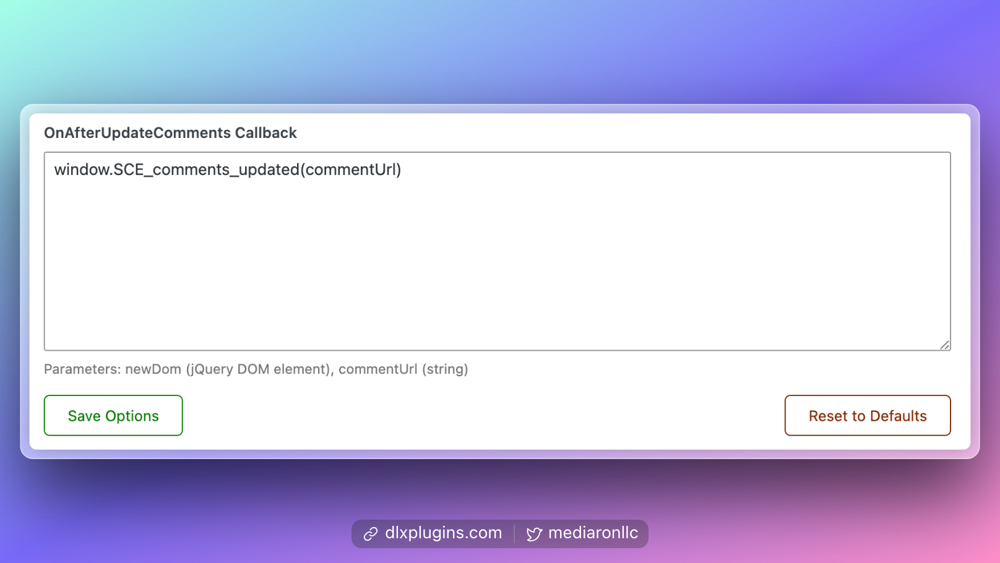

# Comment Edit Core

Comment Edit Core allows you to edit comments for up to 5 minutes.



To ensure compatibility between Comment Edit Core and Ajaxify Comments, you can update the `OnAfterUpdateComments` callback with the following snippet:

```javascript
window.SCE_comments_updated(commentUrl)
```

<figure><figcaption><p>OnAfterUpdateComments Callback for Comment Edit Core</p></figcaption></figure>

You should now be able to edit comments when new comments are posted.
